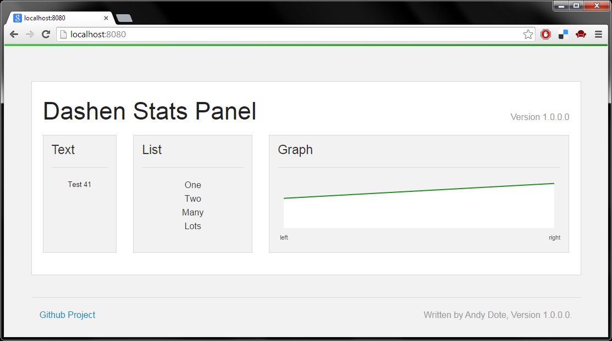

#Dashen

##What is it?
A a self hosted web dashboard for any .net project.
It produces dashboards like this:



##How do I install it?

```powershell
install-package Dashen 	#not published yet
```

##How do I configure it?

```csharp
//everything has a sensible default
var ui = new Dashboard(new DashenConfiguration());

//add a model to display.
ui.RegisterModel(new Definition
{
	//The type of widget you want.  Text, List, Graph or BarGraph.
	Create = () => new TextControlViewModel { Content = "Test" },

	//The title to widget for this box.
	Heading = "Some Text",

	//how often to update this widget, default is 10 seconds.
	Interval = new TimeSpan(0,0,1),

	//How many columns to take up. Number between 1 and 12.
	Width = 2,
});

ui.Start();
```
